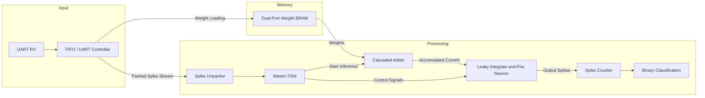

# SNN Accelerator

## Overview
This project implements a hardware **Spiking Neural Network (SNN) inference accelerator** in Verilog targeting FPGA devices (tested for Xilinx Artix-7 style architectures). The design performs end-to-end inference by:

1. Loading synaptic weights through UART.
2. Storing weights in dual-port Block RAM.
3. Receiving packed spike streams.
4. Computing weighted accumulation.
5. Simulating a Leaky Integrate-and-Fire (LIF) neuron.
6. Performing rate decoding.
7. Producing a binary classification result.

The design is fully modular, allowing each stage of the inference pipeline to be verified independently.

---

# Features

- UART-based weight loading
- Dual-port BRAM weight storage
- Packed spike stream support
- Cascaded weighted accumulation engine
- Configurable LIF neuron
- Rate-coded spike decoding
- Central finite-state machine orchestration
- Standalone simulation testbenches

---

# Repository Structure

```text
.
├── snn_top.v
├── fifo_uart_controller.v
├── weight_bram.v
├── spike_unpacker.v
├── cascaded_adder.v
├── lif_neuron.v
├── spike_counter.v
├── master_fsm.v
└── tb/
    ├── tb_cascaded_adder.v
    ├── tb_lif_neuron.v
    └── tb_snn_core.v
```

---

# Complete Architecture

## Data Flow




---

# Module Documentation

## snn_top.v
Top-level integration module.

Responsibilities:
- Instantiates every hardware block.
- Connects UART, BRAM, compute pipeline and decoder.
- Exposes LEDs for inference status.
- Uses 100 MHz clock.
- Configures major design parameters:
  - 4096 weights
  - 16-bit signed weights
  - 32-bit accumulation
  - 25-cycle rate window

---

## fifo_uart_controller.v

Responsibilities

- UART receiver/transmitter
- Byte FIFO
- Converts two received bytes into one 16-bit weight
- Sequentially writes weights into BRAM
- Indicates when all weights are loaded

Interfaces

Inputs
- RX
- FIFO read enable

Outputs
- FIFO data
- FIFO empty flag
- BRAM write address
- BRAM write data
- BRAM write enable
- weights_loaded flag

---

## weight_bram.v

Dual-port inferred Block RAM.

Port A
- UART weight loading

Port B
- Read-only inference access

Configuration

- Depth: 4096
- Width: 16 bits
- Total memory: 65536 bits (8 KB)

The dual-port organization allows weight loading and inference logic to remain cleanly separated.

---

## spike_unpacker.v

Receives packed bytes from the FIFO.

Responsibilities

- Reads one byte
- Extracts one spike bit each clock
- Generates spike_valid pulse
- Handles FIFO reads automatically

State machine

- IDLE
- READ_FIFO
- SHIFT_BITS

---

## cascaded_adder.v

Core MAC-style computation engine.

Operation

For every spike:

- Read corresponding weight
- Account for BRAM read latency with pipeline registers
- Add weight only for active spikes
- Produce accumulated current
- Add bias at completion
- Assert valid signal

Key implementation details

- 4096 sequential weight accesses
- Pipeline alignment for BRAM latency
- Signed arithmetic
- 32-bit accumulator
- Busy/valid handshake

---

## lif_neuron.v

Implements a Leaky Integrate-and-Fire neuron.

Update equation

Membrane_next =
(Membrane − Leak) + Input Current

Leak is implemented using an arithmetic right shift:

Leak = Membrane >> LEAK_SHIFT

Behaviour

- Integrates incoming current
- Applies leakage
- Generates spike above threshold
- Resets membrane after firing
- Exposes membrane potential for debugging

Parameters

- Threshold
- Reset value
- Leak shift
- Width

---

## spike_counter.v

Performs rate decoding.

Responsibilities

- Counts spike events
- Counts silent timesteps
- Operates over configurable window
- Majority decision
- Produces binary output

---

## master_fsm.v

Central controller.

Responsibilities

- Waits for weights
- Starts accumulation
- Enables LIF processing
- Controls spike counter
- Generates inference_done
- Produces classification output
- Coordinates transmit path

Acts as the control plane of the accelerator.

---

# Processing Pipeline

1. Load weights over UART.
2. Store weights in BRAM.
3. Receive packed spike stream.
4. Unpack spikes.
5. Sequentially accumulate weighted input.
6. Feed accumulated current into LIF neuron.
7. Generate output spikes.
8. Count spikes across the observation window.
9. Produce final binary classification.

---

# Testbenches

Included:

- tb_cascaded_adder.v
- tb_lif_neuron.v
- tb_snn_core.v

These cover arithmetic correctness, neuron dynamics and top-level integration.

---

# Design Characteristics

| Parameter | Value |
|-----------|------:|
| Weight count | 4096 |
| Weight width | 16-bit |
| Accumulator | 32-bit |
| BRAM | Dual Port |
| Clock | 100 MHz |
| UART | 115200 baud |
| Decoder Window | 25 cycles |

---

# Possible Future Improvements

- Multi-neuron parallel processing
- Multiple BRAM banks
- Bias memory support
- AXI interface
- DMA-based loading
- Configurable neuron arrays
- Runtime parameter configuration
- Performance counters
- Quantization-aware optimization
- Multi-layer SNN support

---
